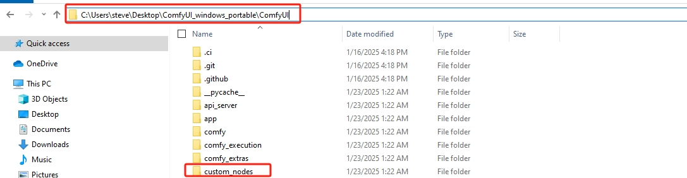

# **Windows Installation Guide**

Installing Ivry CLI on Windows requires setting up the Windows Subsystem for Linux (WSL2) environment, as the CLI relies on Linux-compatible tools.

## **Prerequisites**

Before installing Ivry CLI, ensure you have:

- Windows 10 version 2004 or higher (Build 19041 or higher)
- Administrator privileges on your Windows account
- 8GB of RAM or more (recommended)

## **Step 1: Install Windows Subsystem for Linux 2 (WSL2)**

First, we need to enable WSL2 and install a Linux distribution.

1. **Get ivry_cli github repo**

2. **Open wsl_install.bat in the repo folder as an administrator:**

	   Right-click on wsl_install.bat → Select "Run as administrator".
      This command will enable the required Windows features and install Ubuntu as the default Linux distribution.

3. **Restart your computer when prompted**

4. **After restart, Ubuntu will automatically start and ask you to create a username and password**

If you encounter any issues or want to install a specific Linux distribution, you can use the following steps instead:

1. **Open PowerShell as Administrator**

2. **Enable the WSL feature and the Virtual Machine Platform feature:**

    Run the following commands in PowerShell:

      ```powershell
      dism.exe /online /enable-feature /featurename:Microsoft-Windows-Subsystem-Linux /all /norestart
      ```

      ```powershell
      dism.exe /online /enable-feature /featurename:VirtualMachinePlatform /all /norestart
      ```

3. **Restart your computer**

4. **Download and install the [WSL2 Linux kernel update package](https://docs.microsoft.com/en-us/windows/wsl/install-manual#step-4---download-the-linux-kernel-update-package)**

5. **Set WSL2 as the default:**

      ```powershell
      wsl --set-default-version 2
      ```

6. **Set WSL2 as the default:**

      ```powershell
      wsl --set-default-version 2
      ```

7. Install Ubuntu from the [Microsoft Store](https://www.microsoft.com/store/productId/9PDXGNCFSCZV)

## **Step 2: Install Python and Required Dependencies**

1. **Importing the WSL2 Image**

    A preconfigured WSL2 image is available for download:
    [Download WSL2 Image](https://drive.google.com/file/d/1OK2Sd2Ylwd1J3cMOLr_SgYnhmDdidtOl/view?usp=sharing)

    To import the WSL2 environment, use the following command:

      ```powershell
      wsl --import ivry-cli <path_to_wsl_directory> <path_to_image.tar>
      ```

    Example:

      ```powershell
      wsl --import ivry-cli C:\WSL\Ubuntu C:\User\Downloads\ivry-cli.tar   
      ```

    Once imported, start the WSL2 instance with:

      ```powershell
      wsl -d ivry-cli   
      ```  

2. **Accessing the ivry-cli Environment:**

      ```bash
      cd /opt/ivry_cli
      ```

    Activate virtual environment:

      ```bash
      source venv/bin/activate
      ```

    You could check if the environment is correct by:

      ```bash
      ivry_cli
      ```

    It will show a simple introduction to ivry_cli, you could use "q" to quit

## **Step 3: Create your app**

We support comfyUI apps and python apps.

### **For ComfyUI creator:**

1. Create your app on [ivry website](https://www.ivry.co/login)

2. login from cli

      ```bash
      ivry_cli login YOUR_API_KEY
      ```

3. Pull your project to cli (windows users):

    You need to find your comfyUI directory. It's the directory where have your "custom_nodes"
    

    Make sure your comfyUI dir is in " "

    When using ComfyUI with Ivry CLI, ensure:

    a. ComfyUI is running with the `--listen` flag to enable API access

    b. Port 8188 (or your configured port) is accessible from WSL

      ```bash
      ivry_cli pull_project --app_id your_app_id --comfyUI_dir "your_comfyUI_dir"
      ```

    Example:

      ```bash
      ivry_cli pull_project --app_id 123 --comfyUI_dir "E:\ComfyUI_windows_portable\ComfyUI"
      ```

   You can see your project locate at: /ivry_project/comfyUI_project/app_{your_app_id}/

### **For Python creator:**

1. Create your predict.py 

    You could find a template in /src/templates/predict.py

    After you finished it, please save it to the root of the repo:
    ```
    --comfyui_workflow
    --docs
    --src
    -predict.py
    -READEME.md
    ```

2. login from cli

      ```bash
      ivry_cli login YOUR_API_KEY
      ```

3. Generate predict_signature.json 
   
      ```bash
      ivry_cli parse_predict
      ```
   
   That will generate a predict_signature.json file in the same directory, we will use it later

4. Create your app on [ivry website](https://www.ivry.co/login)

5. Pull your project to cli (windows users):

      ```bash
      ivry_cli pull_project --app_id your_app_id
      ```

    Example:

      ```bash
      ivry_cli pull_project --app_id 123
      ```

## **Step 4: Host your app**

 Start both the ivry_cli model server and cloudflared tunnel:

 ```bash
 cd path/to/your/app
 ivry_cli run_server --force
 ```

### Specify a project path

 Please make sure your current path is at the root directory of the cli

 ```bash
 ivry_cli run_server --project project_folder_name --force #like app_30
 ```

### Stopping the Server

 ```bash
 # Stop all running ivry services
 ivry_cli stop_server [--project_path PATH] [--force]
 ```

The `--force` option allows you to terminate services that may be stuck or not responding to normal shutdown commands.

## Troubleshooting Windows Installation

### WSL Installation Issues

If you encounter problems installing WSL, check:

1. That virtualization is enabled in your BIOS/UEFI
2. That you're running a supported version of Windows 10/11
3. The [official Microsoft WSL troubleshooting guide](https://docs.microsoft.com/en-us/windows/wsl/troubleshooting)

### Path Conversion Problems

If you experience issues with file paths between Windows and WSL:

1. Make sure your files are accessible from both Windows and WSL
2. Use the built-in path conversion utilities in Ivry CLI
3. Test file access with simple commands like `cat` or `ls` before running complex operations

### ComfyUI Connection Issues

If Ivry CLI cannot connect to ComfyUI:

1. Ensure ComfyUI is running with the `--listen` flag
2. Verify you can access the ComfyUI interface from a browser at `http://127.0.0.1:8188`
3. Check your firewall settings to ensure the port is accessible
4. Run `ivry_cli find_comfyUI` to detect running ComfyUI instances

For more detailed troubleshooting, see the [Troubleshooting](../troubleshooting.md) section.