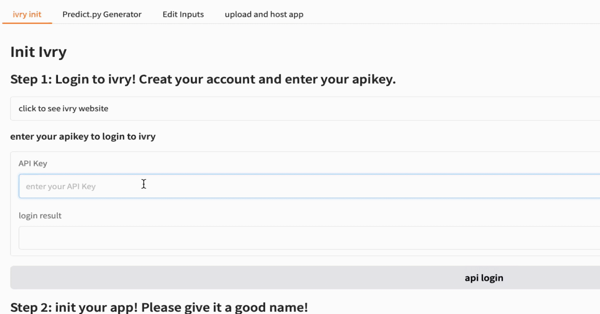

# **Ivry WebUI Guide**

Ivry provides a **Gradio-based WebUI** that allows users to interact with models visually. This guide explains how to launch, configure, and troubleshoot the WebUI on **Windows** and **macOS/Ubuntu**.

---

**For windows users**

Each time enter wsl2, please make sure your enabled the venv. You can activate your venv by:
```bash
source myenv/bin/activate #if you use install.sh to install the environment
```

##1. Login from Webui

Log in and save your authentication credentials on your computer to ensure smooth operation in subsequent steps.
You can easily login from webui by getting apikey from ivry website:



**You only need do this once**, so for next time, you don't need to login again as long as token.txt is located in your machine


### switch accounts

You can switch accounts by login again with different apikey.